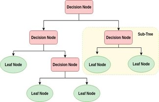
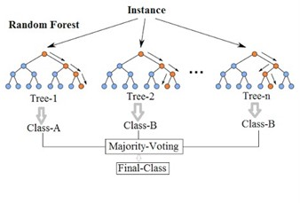

# Predicting pain based on Physiological data using Random Forests and Score-Level Fusion

Dakshin Rathan

# Introduction

In this project, we are discussing a pain recognition system based on physiological data using score level fusion with random forest classifiers. This is an important development and accurately predicting whether someone is in pain is useful for soldiers in combat.

# Method
A decision tree is an algorithm that can classify input data based on a series of decisions. A basic structure of a decision tree is below. The tree startsat the root node and makes splits, or decisions, where the data will move further down the tree. When a pure classification is achieved (ex. Pain or No Pain), a decision is made.

However, a single decision tree is vulnerable to overfitting to the training data and bias of a single data set. To comband this in this paper, we use random forest.

A random forest randomly samples a portion of the input data with replacement and creates many different and unique decision trees. Because of this, different splits occur and different decisions occur in each of the trees. After all the trees have made a decision, the random forest will make a classification in line with the majority decision among the trees.

In this project, we classify whether a subject is in pain or not based entries of signal data for four types of physiological signals: Respiration Rate (RES), Systolic Blood Pressure (SYS), Diastolic Blood Pressure (DIA), and electrodermal activity (EDA).

Training and Testing Random Forest

We used training and testing data of 30 subjects with 8 sets of physiological signal readings: 4 sets corresponding to each type of physiological signal when &quot;pain&quot; was reported and 4 sets when &quot;no pain&quot; was reported. To accomplish classification in this project, we trained four different random forests for each type of physiological signal. However, physiological signal entries are variable and random forests require each set of readings to contain the same number of features. To combat this, we downsampled the physiological readings of all entries to 5000 to create a uniform number of features. Then, we normalized each entry so values range between 0 and 1.

Because we are using one random forest for each type of physiological data, we filtered all of the signal readings for each type of physiological data for each random forest. For example, all of the RES training data will be filtered out to be trained on the RES random forest. This same process is done for the 3 other type of physiological data. The testing data is filtered out in the same way and is used as an input in the testing phase of the random forest. We generate a set of predictions for each subject in the testing data.

Score Level Fusion

After we get predictions from each random forest, we use a method called score level fusion to generate the final result for each subject. For each subject, we have a prediction from each of the 4 random forests corresponding to a type of physiological signal. Whichever choice (pain or no pain) has the majority vote among the 4 trees, is chosen as the final decision for a test subject.
